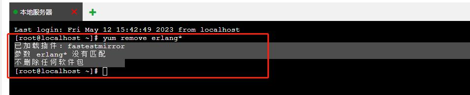

# rabbitMQ 安装与使用记录


- 下载erlang和rabbitmq对应的版本 [erlang和rabbitmq版本对应链接](https://www.rabbitmq.com/which-erlang.html)

- 本次安装 使用的是版本分别为
  1. erlang 25.3.*
  2. rabbitmq 3.11.16

- 安装erlang 需要先安装jdk


## 1. 安装配置erlang

### 1. 检查是否已安装

1. 检测是否拥有erlang语言环境
```shell
yum remove erlang*
```



表示没有安装过erlang

### 2. 安装

1. 安装包下载
  
  ```sheel
  cd /usr/local
  
  mkdir rabbitmq_erlang
  
  cd rabbitmq_erlang
  ```
  
  在`/usr/localrabbitmq_erlang` 目录中进行安装包下载

  - 下载erlang 
  
  ```sheel
  wget --no-check-certificate http://www.erlang.org/download/otp_src_25.3.tar.gz 
  ```
  
2. 安装
  1. 解压 并进入目录
  ```shell
  tar -xvf otp_src_25.3.tar.gz
  
  cd otp_src_25.3
  ```

  2. 安装
  ```shell
  ./configure --prefix=/usr/local/erlang --enable-smp-support --enable-threads --enable-sctp --enable-kernel-poll --enable-hipe --with-ssl --without-javac
  ```
  
  3. 编译与安装
  ```shell
  make && make install
  ```
  
  4. 配置erlang环境变量
  ```shell
  vi /etc/profile
  
  # 将 `export PATH=$PATH:/usr/local/erlang/bin` 添加到文件末尾
  ```
  
  重新加载profile文件让配置生效
  
  ```shell
  source /etc/profile
  ```
    


## 2. 安装配置rabbitMQ


### 1. 安装

1. 安装包下载
  
  ```sheel
  cd /usr/local
  
  mkdir rabbitmq_erlang
  
  cd rabbitmq_erlang
  ```
  
  在`/usr/localrabbitmq_erlang` 目录中进行安装包下载
  
  - 下载rabbitMQ
  ```sheel
  wget https://github.com/rabbitmq/rabbitmq-server/releases/download/v3.11.16/rabbitmq-server-generic-unix-3.11.16.tar.xz
  ```

2. 安装
  1. 解压(由于下载的安装包为xz后缀，先将xz解压为tar后缀)
  ```shell
  cd /usr/local/rabbitmq_erlang
  
  xz -d rabbitmq-server-generic-unix-3.11.16.tar.xz
  
  tar -xvf rabbitmq-server-generic-unix-3.11.16.tar
  
  ```
    
  2. 配置环境变量
  ```shell
  vi /etc/profile
  
  # 将  `export PATH=$PATH:/usr/local/erlang/bin` 改为 `export PATH=$PATH:/usr/local/erlang/bin:/usr/local/rabbitmq_erlang/rabbitmq_server-3.11.16/sbin`
  ```
  
  重新加载profile文件让配置生效
  
  ```shell
  source /etc/profile
  ```

### 3. 启动RabbitMQ

- 启动
```shell
rabbitmq-server -detached 
```

- 验证启动 rabbidMQ 默认端口5672
```shell
lsof -i:5672
```


## 2. rabbitMQ常用命令悉知

### 1. 启动rabbitmq我们可以执行命令
```shell
rabbitmq-server -detached
```

### 2. 启动RabbitMQ管理界面

```shell
rabbitmq-plugins enable rabbitmq_management
```

- 默认地址是localhost（127.0.0.1）使用
- 默认端口是15672
- 默认用户名密码 guest/guest
- guest是超级管理员 拥有所有权限

### 3. 修改默认密码

RabbitMQ是一款可靠的消息传递中间件。如果您安装了RabbitMQ但没有更改默认配置，则默认用户名和密码是：guest/guest。这可以很容易地被各种恶意攻击利用，危及您的系统安全。因此，强烈建议您更改默认设置为更安全的值。

```shell
# 首先登录RabbitMQ命令行界面
rabbitmqctl list_users

# 修改guest用户的密码
rabbitmqctl change_password guest NewPassword
```

### 4. 添加用户
```shell
rabbitmqctl add_user admin admin
```

### 4. 设置用户角色
```shell
rabbitmqctl set_user_tags 用户名 角色
```

- 角色固定有四种级别：
  - administrator：可以登录控制台、查看所有信息、并对rabbitmq进行管理
  - monToring：监控者；登录控制台，查看所有信息
  - policymaker：策略制定者；登录控制台指定策略
  - managment：普通管理员；登录控制

 
### 5. 为用户添加资源权限，添加配置、写、读权限
```shell
# set_permissions [-p <vhostpath>] <user> <conf> <write> <read>

rabbitmqctl set_permissions -p "/" y ".*" ".*" ".*"
```


### 6. 项目中应用

1.  [laravel中应用](https://blog.csdn.net/weixin_41753567/article/details/126097031)