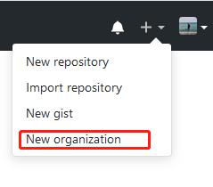
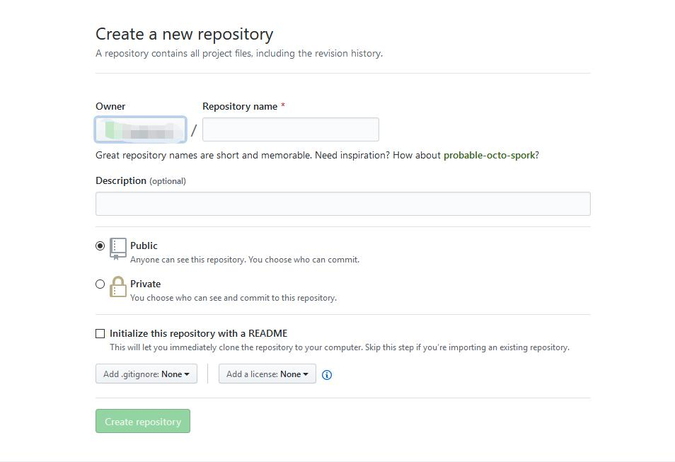
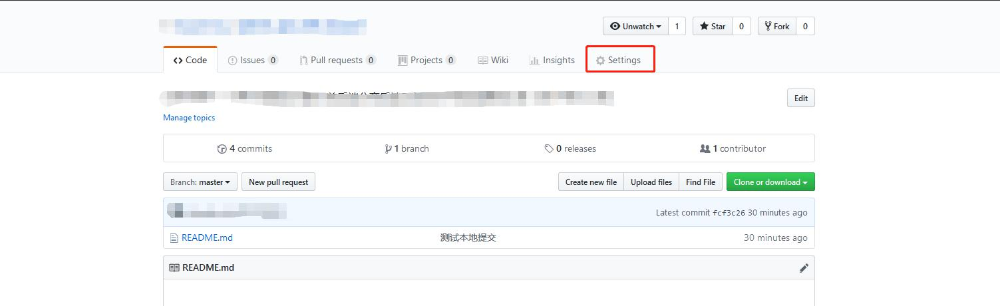
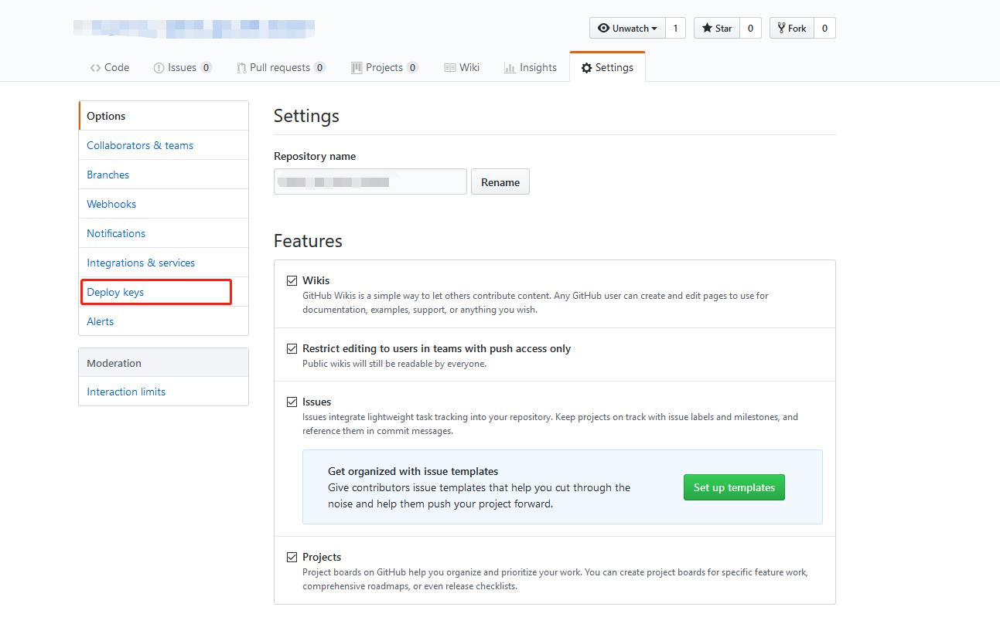
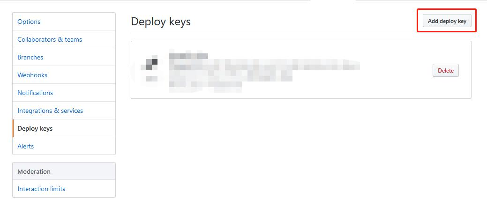
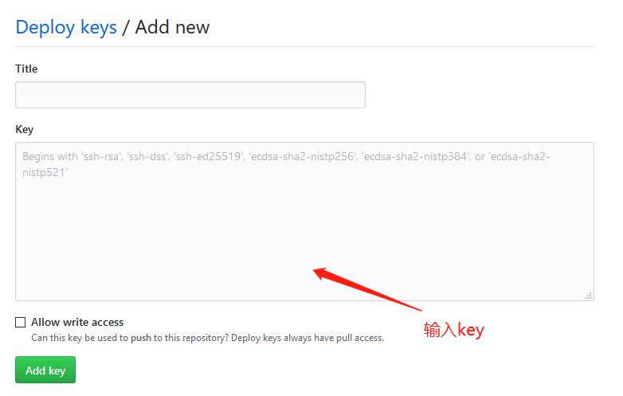

# github 使用

记录使用github的一些基础内容

## 团队建仓 & 个人建仓

### 团队建仓

- 创建机构 Organizations
	
	
	> 创建者已经在团队中，无需额外条件
 
- 创建git在线仓库 Repositoris
	
	
	
- 设置仓库开发者用户权限
	
	1. 	
	2. 
	3. 
	4. 
	
### 个人建仓

> 同团队建仓，少了创建机构相关的步骤
	
## 搭建本地仓库

> 默认本地git已经安装,安装教程见[git安装](https://git-scm.com/book/zh/v1/%E8%B5%B7%E6%AD%A5-%E5%AE%89%E8%A3%85-Git)
	
### 配置git上的用户名和密码

- 在git bash内，输入以下两行命令
```
	git config --global user.name "yourname"
	git config --global user.email "youremail"
```
> yourname处填写你的github用户名，youremail处填写你的github账号

### 在本地创建一个用于存储git项目的文件夹

### 初始化本地项目

- 执行命令初始化
```
git init
```

- 添加要进行版本控制的文件
```
git add file
```
> file 指的是要控制版本的文件,包括文件名和后缀<br/>
> 可以使用 * 将所有文件进行控制

- 提交版本到本地仓库
```
git commit -m "提交备注"
```

## 本地和服务器同步

### 生成本地用户的rsa

> 如果存在C:\用户\你的用户名\.ssh文件夹，则可跳过下面创建的命令

```
cd ~/.ssh                             //转到C:\用户\你的用户名\.ssh文件夹
ssh-keygen -C "youremail" -t rsa      //生成ssh密钥，这条语句会在.ssh文件夹中生成两个必要的文件：id_rsa和id_rsa.pub，
                                      //这是用rsa算法生成的公钥和私钥
```
> - youremail处填写你的github账号
> - 执行完上面两条语句后一路按ENTER键即可
> - 复制生成的密钥 => id_rsa.pub中的内容
> - 在之前设置仓库开发者用户权限的地方输入这个key

### 连接本地和github服务器

- 执行连接命令
```
git -T git@github.com
```
>如果连接成功，会提示 You've successfully anthenticated

### 将服务器上的项目同步到本地仓库

#### 如果本地没项目

- 执行克隆命令，将服务器上的项目克隆到本地
```
git clone git_project_url
```
	
#### 如果本地已经有创建过项目

- 执行获取本地没有的文件命令
```
git remote add origin git_project_url
```
> - git_project_url是要带上.git后缀的，否则会失败。
> - origin是远程主机的名字，你可以把它理解为当前项目的别名你也可以起其他名字，origin是git上原本存在的一个名字，这个步骤会弹出一个窗口让你登陆github，完毕之后就将origin和你的项目匹配起来了

##### 两种方式可以同步github上的项目到本地

- 使用fetch指令
```
git fetch origin                //fetch之后你会发现此时在你本地文件夹中找不到想要同步的项目，因为此时它还在缓存区，你要把它和当前分支合并才行
git merge origin/master         //执行完毕之后你就ok了
```

- 使用pull指令
```
git pull origin master          //等价于上一种方法的两条指令的效果
```

### 将本地项目同步到github服务器

- 使用push命令
```
git push origin master
```
> master 是指上线的主分支名称

## github 常用命令

```
git help <verb> //查看git的命令手册
git help config  //查看配置命令
git log //查看在历史日志
git branch -a   //查看当前所有分支
git branch -d 分支名   //删除某个分支
git checkout 分支名    //切换到某个分支
touch 文件名 //在本地新建一个空白文件
git init    //本地库初始化
git add .文件后缀   //将当前目录中的所有.文件后缀的文件加入到缓存区
git commit -m "提交备注"    //提交
```


